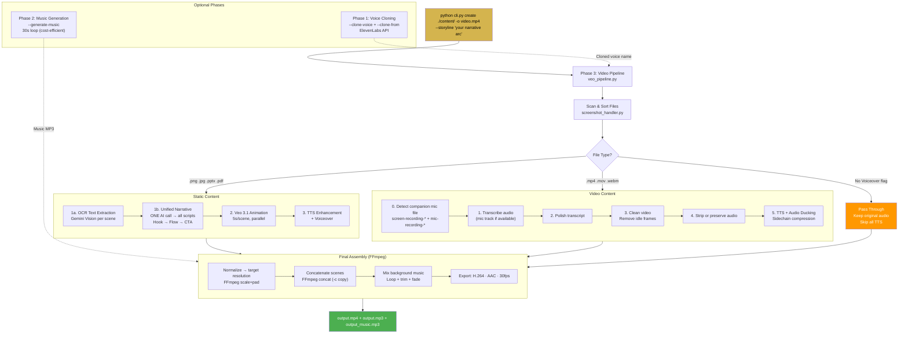
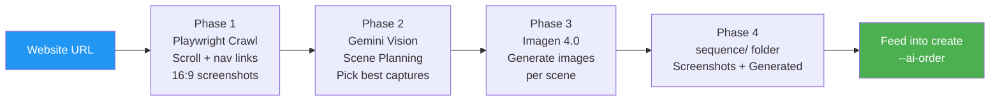
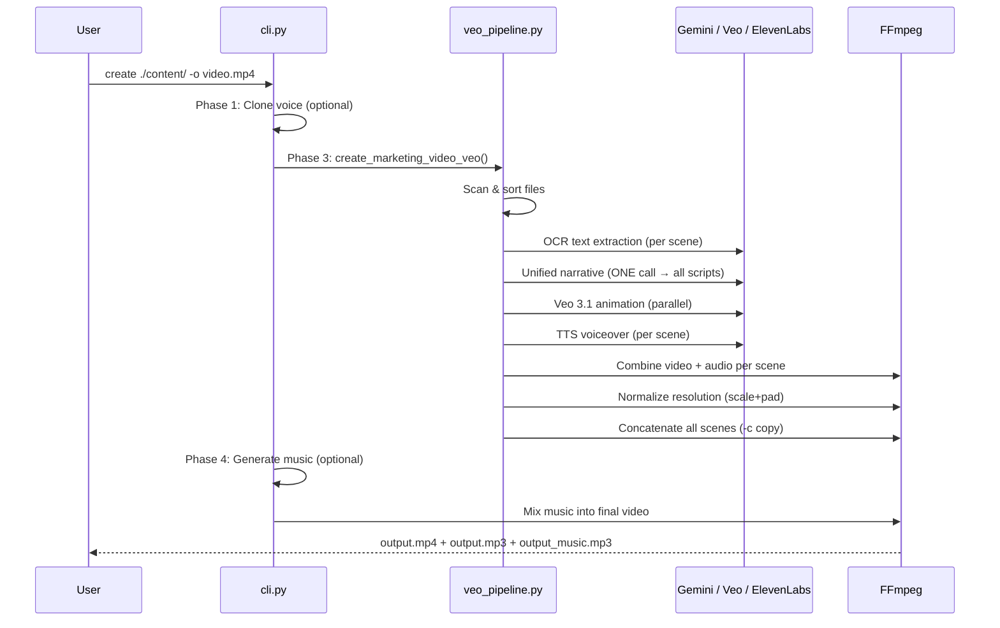

# Transilience VideoGen

<div align="center">

[](https://www.python.org/downloads/)
[](https://ffmpeg.org/)
[](https://modal.com/)
[](https://ai.google.dev/)
[](https://elevenlabs.io/)

**AI-powered pipeline that turns any content into professional marketing videos — images, documents, presentations, videos, or website URLs — with voice cloning, AI music, and cinematic animation.**

[🚀 Quick Start](#-quick-start) • [🏗️ Architecture](#%EF%B8%8F-architecture) • [📖 CLI Reference](#-cli-reference) • [🌐 Web UI](#-web-ui) • [💰 Pricing](#-cost--performance)

</div>

---

## 📋 Table of Contents

- [Overview](#-overview)
- [Quick Start](#-quick-start)
- [Architecture](#%EF%B8%8F-architecture)
- [Features](#-features)
- [CLI Reference](#-cli-reference)
- [Processing Pipeline](#-processing-pipeline)
- [Web UI](#-web-ui)
- [Cost & Performance](#-cost--performance)
- [Project Structure](#-project-structure)
- [Technical Stack](#-technical-stack)

---

## 🎯 Overview

**Transilience VideoGen** automatically creates professional marketing videos from any combination of content. Drop in your files, provide a storyline, and get a polished video with AI-generated animation, voiceover, and music.

### What It Does

```
Images / PPT / PDF / Videos / URLs  →  AI Pipeline  →  Professional Marketing Video
```

- 🎬 **Veo 3.1** animates static images with cinematic motion (zoom, pan, drift)
- 🎙️ **Unified Narrative** — one AI call writes cohesive scripts for all scenes (hook → flow → CTA)
- 🗣️ **Voice Cloning** — clone any voice from a sample, or use premium ElevenLabs voices
- 🎵 **AI Music** — generate a 30s background loop, auto-repeated to fill the video
- 🌐 **URL to Video** — crawl a website, plan scenes with Gemini Vision, generate images with Imagen 4.0
- 🎛️ **Audio Ducking** — system audio auto-lowers under voiceover via sidechain compression
- ⚡ **Fast Assembly** — FFmpeg concat with stream copy (near-instant final merge)

### Why VideoGen?

| | Traditional Video Tools | VideoGen |
|---|---|---|
| **Time** | Hours of manual editing | Minutes (automated) |
| **Cost** | $500–5,000 per video | $0.25–0.65 per video |
| **Input** | Requires edited footage | Any files — images, slides, recordings |
| **Voiceover** | Hire talent or record yourself | AI voices + clone your own |
| **Music** | License tracks | AI-generated, royalty-free |
| **Narrative** | Write scripts manually | AI writes cohesive storyline |

---

## 🚀 Quick Start

### Prerequisites

- **Python 3.9+**
- **FFmpeg** (`brew install ffmpeg` / `apt install ffmpeg`)

### Installation

```bash
pip install -r requirements.txt
playwright install chromium    # For website storyboarding
cp .env.example .env           # Fill in your local secrets; .env stays ignored
```

### API Keys

```bash
export GOOGLE_API_KEY="..."       # Required — Gemini + Veo 3.1 + Imagen 4.0
export ELEVENLABS_API_KEY="..."   # Optional — Premium TTS, voice cloning, music
```

### Usage

```bash
# Run from project/videogen/
cd project/videogen

# Simplest — drop images, get video
python cli.py create ./content/ -o video.mp4

# Full production — voice clone + music + storyline
python cli.py create ./content/ -o video.mp4 \
    --clone-voice "Aman" --clone-from voice_sample.mp3 \
    --generate-music --music-prompt "upbeat corporate" \
    --storyline "A small team discovers AI automation and scales to 10x productivity" \
    --product "My App" --tone "energetic"

# Website URL → storyboard → video
python cli.py storyboard https://example.com \
    --storyline-file story.txt --scenes 9 --product "My App"
python cli.py create storyboard_output/sequence/ -o video.mp4 \
    --ai-order --generate-music

# Screen recording with preserved system audio
python cli.py create ./recordings/ -o tutorial.mp4 \
    --style tutorial --storyline "Step-by-step setup guide"

# Preview without running
python cli.py create ./content/ -o video.mp4 --dry-run
```

---

## 🎬 Sample Videos

| Sample | Description | Source |
|--------|------------|--------|
| [marketing.mp4](project/videogen/samples/video_samples/marketing.mp4) | Full marketing video — voiceover + music | Mixed content |
| [feature_explainer.mp4](project/videogen/samples/video_samples/feature_explainer.mp4) | Product feature walkthrough | Screenshots |
| [Vulnerability_tutorial.mp4](project/videogen/samples/video_samples/Vulnerability_tutorial.mp4) | Security vulnerability tutorial | Screen recording |

> Clone the repo and open files locally to view, or download from GitHub.

---

## 🏗️ Architecture

### `create` — End-to-End Pipeline



### `storyboard` — URL to Video Assets



### Multi-Agent Execution Flow



---

## ✨ Features

### Input Types

| Type | Extensions | Processing |
|------|-----------|------------|
| **Images** | `.png` `.jpg` `.jpeg` `.webp` `.gif` `.bmp` | Gemini Vision OCR + Veo 3.1 animation |
| **PowerPoint** | `.pptx` `.ppt` | Extract slides → process as images |
| **Documents** | `.pdf` `.doc` `.docx` | Extract pages → process as images |
| **Videos** | `.mp4` `.mov` `.avi` `.mkv` `.webm` `.m4v` | Transcribe → Polish → Clean → Re-voice |
| **Screen Recordings** | `screen-recording-*.webm` | Detect mic track → preserve system audio → ducking |
| **Website URLs** | `https://...` | Playwright crawl → Gemini plan → Imagen generate |

Mix any types in one folder — the system processes each intelligently and combines them in filename order.

### AI Capabilities

| Capability | Technology | What It Does |
|-----------|-----------|-------------|
| **Unified Narrative** | Gemini | One call writes cohesive scripts for ALL scenes (hook → flow → CTA) |
| **Veo 3.1 Animation** | Google Veo | Cinematic zoom/pan/drift on static images, 5s per scene |
| **TTS Enhancement** | Claude | Adds delivery cues (CAPS emphasis, dashes for pauses, energy gradient) |
| **Voice Cloning** | ElevenLabs | Clone any voice from an audio sample |
| **AI Music** | ElevenLabs/Suno | Generate 30s background loop, auto-repeated |
| **Scene Ordering** | Gemini Vision | Auto-sequence scenes into logical narrative flow |
| **Imagen 4.0** | Google Imagen | Generate futuristic tech visuals from text prompts |
| **Style Profiles** | Built-in | marketing, demo, explainer, pitch, tutorial personas |

### Audio Processing

| Feature | How It Works |
|---------|-------------|
| **Audio Ducking** | FFmpeg sidechain compression — system audio ducks under voiceover (attack=100ms, release=800ms) |
| **Per-File Control** | Toggle "Keep original audio" to skip voiceover for specific files |
| **Companion Mic** | Screen recordings auto-detect separate mic file; transcribe mic, preserve system audio |
| **Triple Output** | `.mp4` video + `.mp3` voice+music + `.mp3` music only |

### Video Processing

| Feature | How It Works |
|---------|-------------|
| **FFmpeg Assembly** | Normalize + concat with stream copy (near-instant final merge) |
| **Video Cleaning** | Remove still/idle frames before re-voicing |
| **Avatar Overlay** | Composite image/video avatar on any corner (CLI + Web UI) |
| **Bookends** | AI-generated intro/outro frames (Gemini + Imagen + Veo) |
| **Resolution** | 720p, 1080p, 4K — all clips normalized to target |

---

## 📖 CLI Reference

### `create` — All-in-One Video Generation

```bash
python cli.py create INPUT_PATH [OPTIONS]

# Core
  -o, --output TEXT              Output file (default: output.mp4)
  --storyline TEXT               Narrative arc to guide scripts + animation
  --product TEXT                 Product name
  --tone TEXT                    Script tone (default: professional and engaging)
  --style CHOICE                 marketing|demo|explainer|pitch|tutorial
  --resolution CHOICE            720p | 1080p | 4k

# Voice
  --voice TEXT                   TTS voice (default: Smritika)
  --tts-engine CHOICE            elevenlabs | edge (free)
  --clone-voice NAME             Clone voice from audio sample
  --clone-from AUDIO_FILE        Audio sample for cloning
  --voice-speed FLOAT            Speech rate (1.0 = normal)

# Music
  --generate-music               Generate AI background music
  --music-prompt TEXT            Music style prompt
  --music PATH                   Use existing music file
  --music-volume FLOAT           Mix volume (default: 0.03)

# Pipeline
  --max-workers INT              Parallel Veo calls (default: 3)
  --script-duration INT          Target narration seconds (default: 60)
  --scene-duration INT           Seconds per Veo scene (default: 5)
  --ai-order / --no-ai-order     AI scene ordering (default: on)
  --intro / --no-intro           Generate branded intro frame
  --outro / --no-outro           Generate branded outro frame
  --blend                        Blend assets from subfolders
  --mix SPEED,VOICE,MUSIC        Audio shorthand (e.g. "1.2,6.0,0.04")
  --dry-run                      Preview plan without running
```

### `storyboard` — Website to Visual Assets

```bash
python cli.py storyboard URL [OPTIONS]

  --storyline TEXT / --storyline-file PATH
  --scenes INT                   Number of scenes (default: 6)
  --product TEXT                 Product name
  --style CHOICE                 marketing|demo|explainer|pitch|tutorial
  --skip-imagen                  Screenshots only
  --skip-screenshots             Imagen only
  --login                        Google sign-in for auth-required sites
  --dry-run                      Preview scene plan
```

### Other Commands

| Command | Purpose | Example |
|---------|---------|---------|
| `avatar` | Add avatar overlay | `python cli.py avatar video.mp4 avatar.png -o out.mp4` |
| `veo-marketing` | Pipeline only (no clone/music) | `python cli.py veo-marketing ./content/ -o out.mp4` |
| `generate` | Basic video (no Veo) | `python cli.py generate ./content/ -o video.mp4` |
| `voice-clone` | Clone a voice | `python cli.py voice-clone "Name" recording.mp3` |
| `music` | Generate music | `python cli.py music -o bg.mp3 --prompt "upbeat"` |
| `voices` | List voices | `python cli.py voices --engine elevenlabs` |
| `veo` | Direct Veo access | `python cli.py veo image.png --prompt "gentle motion"` |
| `engage` | Cursor animations | `python cli.py engage ./screenshots/ -o out.mp4` |
| `info` | Setup guide | `python cli.py info` |

---

## 🔄 Processing Pipeline

### Static Content (Images / PPT / PDF)

```
Step   What                                How
─────  ──────────────────────────────────  ──────────────────────────────────────
1a     OCR text extraction                 Gemini Vision per scene
1b     Unified narrative                   ONE AI call → all scene scripts
2      Veo 3.1 animation                  Parallel (--max-workers), 5s/scene
3      TTS enhancement                    Emphasis, pauses, energy gradient
3b     Voiceover generation               ElevenLabs or Edge TTS
4      Combine video + audio              FFmpeg merge
```

### Video Content

```
Step   What                                How
─────  ──────────────────────────────────  ──────────────────────────────────────
0      Detect companion mic file           screen-recording-* + mic-recording-*
1      Transcribe audio                   ElevenLabs Scribe (mic if available)
2      Polish transcript                  AI rewrite + scene position context
3      Clean video                        Remove still/idle frames
4      Strip or preserve audio            Preserve for screen recordings
5      TTS voiceover                      Enhanced script → voice
6      Combine with ducking               Sidechain compression (screen rec)
                                          or simple mix (normal video)
```

### Final Assembly

```
Step   What                                How
─────  ──────────────────────────────────  ──────────────────────────────────────
1      Normalize resolution               FFmpeg scale+pad (720p/1080p/4K)
2      Concatenate scenes                 FFmpeg concat demuxer (-c copy)
3      Mix background music               Loop 30s clip + trim + fade
4      Export                             H.264 · AAC 192kbps · 30fps
5      Extract audio                      MP3 44.1kHz stereo 192kbps
```

### Mixed Content Example

**Input:**
```
marketing/
├── 01_title.png          # Image
├── 02_pitch.pptx         # 3 slides
├── 03_demo.mov           # Video with voiceover (45s)
├── 04_features.pdf       # 2 pages
└── 05_cta.jpg            # Image
```

**Result:** 8 scenes, ~99 seconds — cohesive narrative with opening hook, natural flow around the video segment, and closing CTA. Three output files: `.mp4` + `.mp3` + `_music.mp3`.

---

## 🌐 Web UI

Deploy with Modal:

```bash
modal deploy modal_app.py
```

### Endpoints

| Endpoint | Method | Purpose |
|----------|--------|---------|
| `/` | GET | Web interface |
| `/create` | POST | Start video generation |
| `/status/{job_id}` | GET | Poll job status + logs |
| `/download/{job_id}` | GET | Download finished video |
| `/storyboard` | POST | Start storyboard generation |
| `/storyboard-status/{job_id}` | GET | Poll storyboard status |
| `/avatar` | POST | Apply avatar overlay |

---

## 💰 Cost & Performance

### Estimated Costs (10 scenes)

| Component | Cost |
|-----------|------|
| Gemini Vision | ~$0.03 |
| Veo 3.1 Animation | ~$0.20–0.50 |
| ElevenLabs TTS | ~$0.02–0.05 |
| Music Generation | ~$0.01–0.05 |
| **Total** | **~$0.25–0.65** |

> 💡 **Free alternative:** Edge TTS + `generate` command (no Veo) = ~$0.03

### Processing Times

| Input | Time (--max-workers 3) |
|-------|------------------------|
| 5 images | ~8–10 min |
| 10 slides (PPT) | ~12–16 min |
| 2 min video | ~2–3 min |
| Mixed (5 images + 1 video) | ~10–13 min |

---

## 📁 Project Structure

```
video_generator/
├── CLAUDE.md                              # Architecture & rules
├── README.md                              # Project overview (this file)
├── requirements.txt                       # Python dependencies
├── .env                                   # API keys (not tracked)
├── .gitignore
│
├── .claude/                               # Claude Code config
│   ├── settings.local.json
│   └── skill/                             # Skill files mirroring src/ modules
│       ├── ai/                            #   *.skills.md per AI module
│       ├── pipeline/                      #   *.skills.md per pipeline module
│       ├── processing/                    #   *.skills.md per processing module
│       ├── core/                          #   *.skills.md per core utility
│       └── generators/                    #   *.skills.md per generator
│
└── project/
    └── videogen/
        ├── cli.py                         # CLI entry point (all commands)
        ├── process_recording.py           # Standalone video processor
        ├── samples/
        │   ├── input_samples/             # Sample input files
        │   └── video_samples/             # Generated sample videos
        └── src/
            ├── ai/
            │   ├── gemini_client.py        # Gemini API (Vision, content generation)
            │   ├── ai_analyzer.py          # Image analysis + script generation
            │   ├── veo_generator.py        # Veo 3.1 image-to-video
            │   ├── tts_engine.py           # TTS + STT + voice cloning
            │   └── imagen_generator.py     # Imagen 4.0 text-to-image
            ├── pipeline/
            │   ├── veo_pipeline.py         # Main orchestrator
            │   ├── screenshot_handler.py   # File loading, PPT/PDF extraction
            │   ├── blend_handler.py        # Multi-folder blending
            │   ├── bookend_generator.py    # Intro/outro (Gemini + Imagen + Veo)
            │   ├── storyboard_planner.py   # Gemini Vision scene planning
            │   └── website_screenshotter.py # Playwright crawling
            ├── processing/
            │   ├── avatar_overlay.py       # FFmpeg avatar compositing
            │   ├── video_cleaner.py        # Remove still/idle frames
            │   ├── video_effects.py        # Visual effects
            │   └── video_extractors.py     # Keyframe extraction
            ├── core/
            │   ├── image_utils.py          # Image manipulation
            │   ├── video_utils.py          # Video inspection
            │   └── audio_utils.py          # Audio manipulation
            └── generators/
                ├── music_generator.py      # Music (ElevenLabs, Suno, Replicate)
                └── text_animator.py        # Text animation
```

---

## 🔧 Technical Stack

| Layer | Technologies |
|-------|-------------|
| **AI / ML** | Google Gemini Vision, Veo 3.1, Imagen 4.0, ElevenLabs (TTS + STT + cloning + music) |
| **Video** | FFmpeg (concat demuxer, sidechain compression, scale+pad), OpenCV, MoviePy |
| **Web** | FastAPI, Modal (serverless), Playwright (headless Chromium) |
| **Documents** | python-pptx, pdf2image, Pillow |

### Output Specs

| Format | Details |
|--------|---------|
| **Video** | H.264, AAC 192kbps, 30fps — 720p / 1080p / 4K |
| **Audio** | MP3, 44.1kHz stereo, 192kbps |
| **Music** | MP3, 44.1kHz stereo, 192kbps (trimmed to video length) |

### Required API Keys

```bash
cp .env.example .env
export GOOGLE_API_KEY="..."       # Required — Gemini + Veo 3.1 + Imagen 4.0
export ELEVENLABS_API_KEY="..."   # Optional — Premium TTS, voice cloning, music
export GOOGLE_EMAIL="..."         # Optional — Auto sign-in for storyboard --login
export GOOGLE_PASSWORD="..."      # Optional — Auto sign-in for storyboard --login
```

---

<div align="center">

**Built by [Transilience AI](https://www.transilience.ai)**

</div>
# communitytools-marketing
